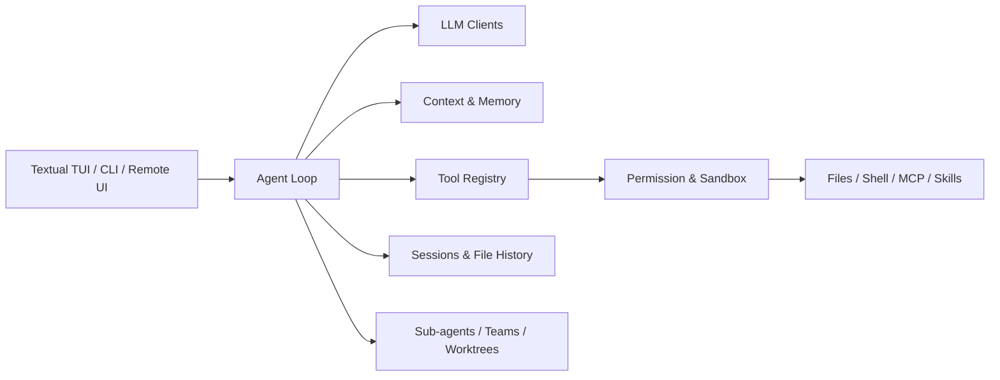

# CodePilot CLI

[](https://www.python.org/)
[](https://modelcontextprotocol.io/)

CodePilot 是一个运行在终端中的 AI 编程助手。它将流式对话、文件与命令工具、权限控制、会话恢复、长期记忆、MCP、Skills、子 Agent 和 Git Worktree 集成在一个 Textual TUI 中，也支持非交互脚本和本地浏览器界面。

> 当前处于 Alpha 阶段，适合作为 AI Agent 工程实践和个人作品展示。请先在测试仓库中使用，并始终审阅模型生成的命令与代码改动。

## 功能概览

- **终端优先**：Textual TUI、流式输出、工具调用状态、斜杠命令补全。
- **多模型接入**：Anthropic、OpenAI 及 OpenAI-compatible API。
- **工程工具链**：读写文件、精准编辑、Glob/Grep、Shell、diff 与文件历史。
- **安全边界**：四种权限模式、危险命令检测、路径沙箱、可选 OS 沙箱和 Hook 校验。
- **上下文治理**：工具结果预算、自动压缩、恢复附件、长期记忆与会话持久化。
- **可扩展能力**：MCP 2.x、项目 Skills、自定义 Agent、后台任务和团队协作。
- **Git 工作流**：隔离 Worktree、进入/退出工作树、陈旧工作树清理。
- **多种运行方式**：交互 TUI、`-p` 非交互模式、NDJSON 输出、本地 WebSocket 界面。

## 架构



核心循环只负责模型流、工具调度和对话状态；模型协议、权限策略、上下文压缩、持久化与 UI 分层实现，便于独立测试和替换。

## 快速开始

### 1. 安装依赖

需要 Python 3.11+ 和 [uv](https://docs.astral.sh/uv/)。

```bash
git clone https://github.com/chenkz666/codepilot-cli.git
cd codepilot-cli
uv sync --locked --dev
```

### 2. 配置模型

先复制不含密钥的示例配置：

```powershell
New-Item -ItemType Directory -Force .codepilot
Copy-Item config.example.yaml .codepilot/config.yaml
$env:OPENAI_API_KEY = "your-api-key"
```

Linux / macOS：

```bash
mkdir -p .codepilot
cp config.example.yaml .codepilot/config.yaml
export OPENAI_API_KEY="your-api-key"
```

编辑 `.codepilot/config.yaml`，填写实际的 `base_url` 和 `model`。OpenAI-compatible provider 在 `api_key` 为空时读取 `OPENAI_API_KEY`；Anthropic provider 读取 `ANTHROPIC_API_KEY`。

`.codepilot/` 会保存配置、会话、记忆、调试日志和工具结果，已被 Git 忽略。不要把真实密钥写入 `config.example.yaml`、README、测试或截图。

### 3. 运行

```bash
# 交互式 TUI
uv run codepilot

# 单次非交互任务
uv run codepilot -p "分析当前项目结构并给出改进建议"

# 供脚本消费的 NDJSON 事件流
uv run codepilot -p "运行测试并总结失败原因" --output-format stream-json

# 本地浏览器界面，默认只监听 127.0.0.1:18888
uv run codepilot --remote
```

## 常用斜杠命令

| 命令 | 作用 |
| --- | --- |
| `/help` | 查看命令帮助 |
| `/clear` | 清空当前对话并重置会话级状态 |
| `/session` | 新建、列出或恢复会话 |
| `/compact` | 手动压缩上下文 |
| `/permission` | 切换权限模式 |
| `/plan` | 进入计划模式 |
| `/review` | 审查当前改动 |
| `/rewind` | 回退文件历史快照 |
| `/memory` | 查看或管理长期记忆 |
| `/mcp` | 查看 MCP 服务状态 |
| `/skill` | 管理项目 Skills |
| `/worktree` | 管理隔离工作树 |
| `/tasks`、`/trace` | 查看后台任务与 Agent 调用链 |

在输入框键入 `/` 或命令前缀即可打开补全列表；项目 Skill 也会动态注册为斜杠命令。

## 权限模式

| 模式 | 行为 |
| --- | --- |
| `default` | 读取自动允许，写入与命令按策略确认 |
| `acceptEdits` | 自动接受文件编辑，命令仍按策略确认 |
| `plan` | 限制写入，只允许维护计划文件 |
| `bypassPermissions` | 跳过常规确认，但危险命令检测仍生效 |

可以在配置中设置 `permission_mode`，也可以临时使用 `--mode` 覆盖。不要在不可信仓库中使用 `bypassPermissions`。

## 项目结构

```text
codepilot/
├── agent.py              # Agent 主循环与工具调度
├── app.py                # Textual TUI
├── client.py             # 模型协议客户端
├── context/              # 上下文预算、压缩与恢复
├── permissions/          # 权限矩阵、规则与沙箱
├── memory/               # 会话、长期记忆与后台整理
├── tools/                # 内置工具与工具注册表
├── mcp/                  # MCP 客户端与工具适配
├── commands/             # 斜杠命令系统
├── agents/               # 子 Agent、任务与追踪
├── teams/                # 团队、邮箱与运行后端
└── worktree/             # Git Worktree 生命周期
tests/                    # 单元测试与集成测试
```

## 开发与质量检查

```bash
uv sync --locked --dev
uv run ruff check codepilot tests
uv run pytest -q
uv build
```

## 安全

- Remote UI 默认仅监听 `127.0.0.1`。只有在可信网络并配置额外访问控制时才使用 `--remote-host 0.0.0.0`。
- Hook、MCP 服务和 Skills 都可能执行外部程序；只安装和启用可信来源。
- 如果密钥曾进入提交历史，仅加入 `.gitignore` 不够：请先撤销/轮换密钥，再清理 Git 历史。

## Roadmap

- [ ] 拆分高复杂度 Agent/TUI 主循环，减少状态耦合
- [ ] 增加 Remote UI 身份认证与 CSRF/Origin 策略
- [ ] 增加 MCP HTTP 真实服务集成测试
- [ ] 增加可复现的终端录屏与性能基准
